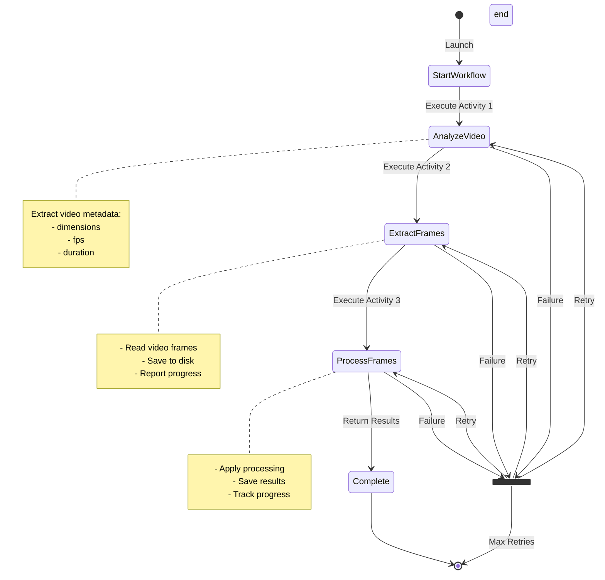
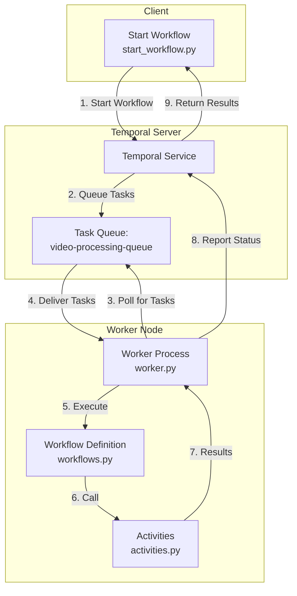

# Temporal Video Processing 

A demonstration of using Temporal.io for orchestrating video processing workflows. This project shows how to structure long-running video processing tasks using Temporal's workflow engine.

## Architecture

The system consists of three main components:
1. Workflow Starter (start_workflow.py)
2. Worker Process (worker.py)
3. Activity Definitions (activities.py)

## System Architecture Diagram

The diagram above shows how the different components interact through the Temporal server.

## Workflow Process

The following diagram shows the video processing workflow sequence, including retry logic and state transitions.

## Installation

1. Install dependencies:
```bash
pip install -r requirements.txt #or use uv ;) 
```

2. Ensure Temporal server is running at localhost:7233

## Usage

1. Start the worker process:
```bash
python worker.py
```

2. In a separate terminal, start the workflow:
```bash
python start_workflow.py
```

## Components

### start_workflow.py
- Entry point for starting workflow executions
- Connects to Temporal server, starts workflow and waits for results

### worker.py
- Long-running process that executes waits for work and fires/monitors activities under a task-queue

### workflows.py
- Defines workflow structure and sequencing
- Orchestrates actual activity execution

### activities.py
- Implements individual processing tasks
- Reports progress via heartbeats

## Features

- Well seperated architecture, simple enough to copy as a template
- Automatic retries
- Progress tracking and heartbeats

## Error Handling

The system includes comprehensive error handling:
- Automatic retries, exponential backoff
- Activity timeouts
- Progress monitoring

## Monitoring

Monitor workflow execution through:
- Temporal Web UI
- Worker logs and temporal server log

## Some diagrams (thanks Claude)

### State diagram



### Architecture


